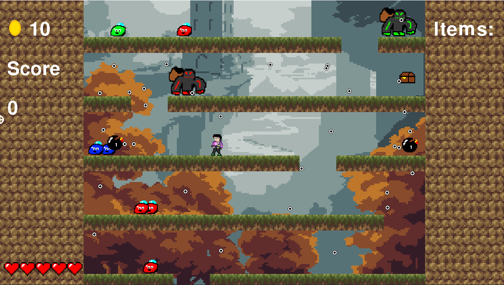
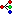
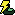

# Color Ascend

## by Kiril Avramoski

### This project is part of the Game Programming course at the Faculty of Computer Science and Engineering in Skopje

## Overview

**Color Ascent** is a platformer shooter game where the goal of the player is to achieve as high a score as possible. The game follows the standards of the classic genre, with a layout and goal similar to Donkey Kong, where the goal of the player is to reach the top platform an continue on the next level. It also includes rogue-like elements with the ability to pick up items and improve the player's stats, which was inspired by the game Risk of Rain.

This game was developed using the [py-game](https://www.pygame.org/news) package for python using PyCharm.

To run the code, download the .zip file of this repository, extract it in a folder of your choice, open it with PyCharm and run main.py.

## Gameplay

The player controls a human figure equiped with a gun that shoots colored balls. With each bounce the ball changes color, and after a number of these bounces it disappears. The goal of the player is to climb up through gaps in the ceiling and reach the highest point of the level where a door is located that will take the player to the next level. Along the way on each row the player will encounter two types of enemies which will shoot harmful projectiles. Each hit that the player recieves will reduce the health of the player, and if the health reaches zero, the game ends.

The player can increase the score by killing enemies, which can be one of three colors: red, green and blue. To kill the enemy, the player must hit it with the correct color, by bouncing the gun projectile the correct amount of times.

Below you can see the three types of *blobs*.

Red | Green | Blue
:-------------------------:|:-------------------------: | :-------------------------:
  |    | 

In addition to receiving score, the player also receives coins which can be used to open chests which can be found spread across each level. When the player open a chest, 1 of 4 items is received. These 4 items improve the player's stats in different ways. One increases the attack power, one increases the number of projectiles the player shoots, one increases the number of times the player can jump, and the last one increases the movement speed of the player. As the levels increase, so does the price of the chests, requiring the player to kill more and more monsters as he progresses in the game. 

Attack power | Number of projectiles | Extra Jump | Speed increase
:--: | :--: | :--: | :--:
 |  |  | 

